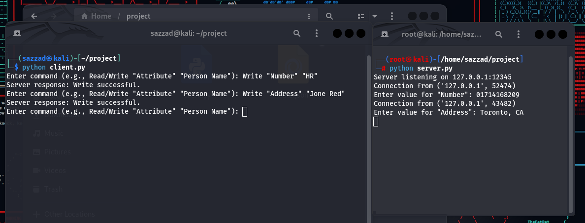
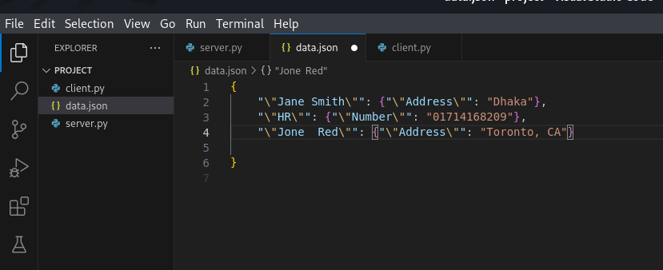

# Develop a simple TCP/IP client-server application in Python to handle reading and writing attributes associated with a person's name.

<a href="(https://www.youtube.com/watch?v=j4H9RSkBhS4)">User Manual on Youtube</a>

  
  

socket: Provides low-level networking interface.
json: Used for encoding and decoding JSON data.
handle_command: Processes incoming commands. Reads or writes data based on the action specified.
send_command is a function that takes a command (a string) as its argument.
socket.AF_INET specifies the address family for IPv4. socket.SOCK_STREAM indicates that this will be a TCP socket.
response = client_socket.recv(BUFFER_SIZE).decode() receives the server's response. BUFFER_SIZE determines the maximum amount of data to be received at once. The response is then decoded from bytes to a string.
